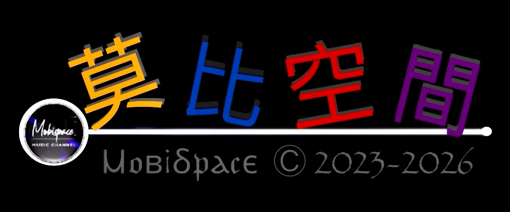

  

<h1 align="center" style="border-bottom: none; color: #58a6ff; font-family: monospace;">Ⲙ𝔬ⲃ¡ⳝ𝔭ⲁⲁ𝔠𝔢 | 莫比空間</h1>

  
  
  

---

### 🌐 核心入口 (The Portal)
> **Endpoint Service** ‧ 封裝全站核心視圖路徑

| 類型 | 存取節點 (Quick Links) |
| :--- | :--- |
| **ENTRY** | [`🏠 官方首頁`](https://mobsp.qzz.io/index.html) ‧ [`🗂️ 全域索引`](https://mobsp.qzz.io/app/index.html) ‧ [`⚙️ 設定`](https://mobsp.qzz.io/setting/index.html) |
| **KNOWLEDGE** | [`📖 Wiki 中心`](https://mobsp.qzz.io/wiki/index.html) ‧ [`🧪 實驗基地`](https://mobsp.qzz.io/beta/index.html) ‧ [`⏳ 歷史`](https://mobsp.qzz.io/history.html) |
| **STREAM** | [`🎬 短影音`](https://mobsp.qzz.io/shorts/index.html) ‧ [`🎨 SVG 編輯器`](https://mobsp.qzz.io/svg-editor/index.html) |

---

### 📁 資產矩陣：工具庫 (Toolbox Matrix)
> `/tol/` 生產力組件清單 ‧ 高效自動化工作流

| 路徑 (Local Path) | 模組描述 | 指令狀態 |
| :--- | :--- | :---: |
| `/tol/index.html` | **工具箱總匯門戶** | `RUNNING` |
| `/tol/x-harv/index.html` | **Monolithic Harvester** 資源抓取 | `READY` |
| `/tol/gh-idx/index.html` | **GitHub Index** 自動化索引引擎 | `SYNC` |
| `/tol/publisher/index.html` | **內容發布端** 自動化部署 | `SECURE` |
| `/tol/convert/index.html` | **數據格式多向轉換** | `STABLE` |
| `/tol/rss-generator.html` | **動態 RSS 訂閱源生成** | `LIVE` |
| `/tol/k-zero/index.html` | **K-Zero 核心邏輯處理器** | `CORE` |
| `/tol/ve/index.html` | **Visual Engine 視覺預覽** | `BETA` |

> [!TIP]
> 點擊 [`🎨 SVG 牆`](https://mobsp.qzz.io/assets/icon/viewer/index.html) 可存取全量 `assets/icon/svg/` 資源。

---

### 🔒 限制級封鎖區域 (Classified Collections)
> **Access Denied.** 此區塊已受物理摺疊與密鑰驗證邏輯保護。

<b>🗝️ [ 點擊驗證身分並展開受限內容 ]</b>

 

> [!CAUTION]
> **警告：身分確認中...**
> 內含個人私密日誌及成人限制級文學 (18+)。進入後代表您已成年並願承擔法律責任。

* **[ 🔐 秘密清單 ]** &nbsp; [Blog 核心入口](https://mobsp.qzz.io/blog/index.html)
* **[ 🔞 風月文學 ]** &nbsp; [全系列 Vol.1 - 25](https://mobsp.qzz.io/blog/p/list/風月文學網 .html)
* **[ ⛓️ 背德系列 ]** &nbsp; [母、姊、媳系列索引](https://mobsp.qzz.io/blog/p/list/風月文學網3.html)
* **[ 📝 佈局架構 ]** &nbsp; [_layouts/mobi-space-article.html](https://mobsp.qzz.io/_layouts/mobi-space-article.html)

**狀態：** 偵測到訪問授權。請確保頁面 JavaScript 正常運行以啟動 Age-Gate。

---

  
   
  <i>System Optimized by <b>Titi</b> for <b>Chief</b> | 2026</i>

