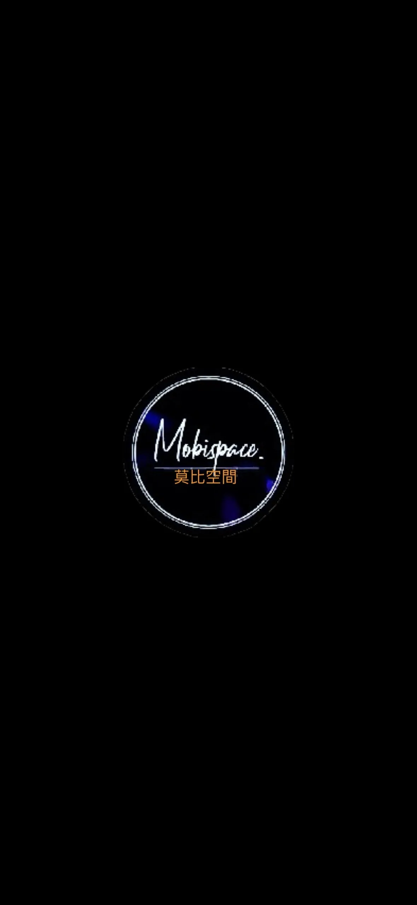

  
  

<h1 align="center">Ⲙ𝔬ⲃ¡ⳝ𝔭ⲁⲁ𝔠𝔢 | 莫比空間 Ⓒ 2023-2026</h1>

  <strong>極簡．高效．流暢 — 您的全方位數位資源入口</strong>

  
  
  

---

## 🌐 核心服務入口 (Core Services)

> 點擊下方連結直接進入「莫比空間」的各個核心模組。

| 模組名稱 | 快速存取連結 | 說明 |
| :--- | :--- | :--- |
| **🏠 官方首頁** | [進入空間](https://mobsp.qzz.io/index.html) | 門戶與導航中心 |
| **🛠️ 工具門戶** | [工具箱主頁](https://mobsp.qzz.io/tol/index.html) | 包含轉檔、編輯、掃描等生產力工具 |
| **📖 知識百科** | [Wiki 中心](https://mobsp.qzz.io/wiki/index.html) | 專案說明與數據庫 |
| **✍️ 數位日誌** | [Blog 列表](https://mobsp.qzz.io/blog/index.html) | 存儲文章與風月文學系列 |
| **⚙️ 偏好設定** | [系統設定](https://mobsp.qzz.io/setting/index.html) | 個人化介面與亮暗模式調整 |
| **🧪 實驗基地** | [Beta 測試區](https://mobsp.qzz.io/beta/index.html) | 最新技術預覽與組件測試 |

---

## 📁 系統資產矩陣 (Asset Matrix)

針對開發者與內容維護者的快速索引：

* **UI 設計資產**: 
    * [SVG 展示牆](https://mobsp.qzz.io/assets/icon/viewer/index.html) - 極致縮放的 UI 零件。
    * [SVG 編輯器](https://mobsp.qzz.io/svg-editor/index.html) - 在線向量圖形處理。
* **數據與配置**:
    * [數據中心 (JSON)](https://mobsp.qzz.io/tol/data.json) - 驅動整個應用的靈魂。
* **多媒體資源**:
    * [短影音專區](https://mobsp.qzz.io/shorts/index.html) - 動態視覺展示。

---

## 🏗️ 技術架構 (Architecture)

本專案採用 **Vue.js** 單頁面應用架構，並針對 **GitHub Pages** 進行了深度靜態優化：

* 🚀 **PWA 支持**：提供離線訪問與原生 App 級別的流暢體驗。
* 📊 **數據驅動**：工具庫與子頁面高度依賴 JSON 配置，實現「無痛更新」。
* 📱 **響應式佈局**：iOS 靈感設計，完美兼容手機、平板與桌面端。
* 🤖 **自動化流水線**：透過 GitHub Actions 實現自動索引產生與 WebP 圖片優化。

---

## 🛠️ 開發與自動化 (CI/CD)

專案內建多項 Python 與 Node.js 腳本以維持生態穩定：
* `auto-index.py` & `generate-index.js`: 自動掃描並生成全站索引。
* `webp-magic.yml`: 自動將點陣圖轉化為高效能 WebP 格式。

---

  <i>Made with ❤️ by Ⲙ𝔬ⲃ¡ⳝ𝔭ⲁⲁ𝔠𝔢 | Designed by Titi</i>

